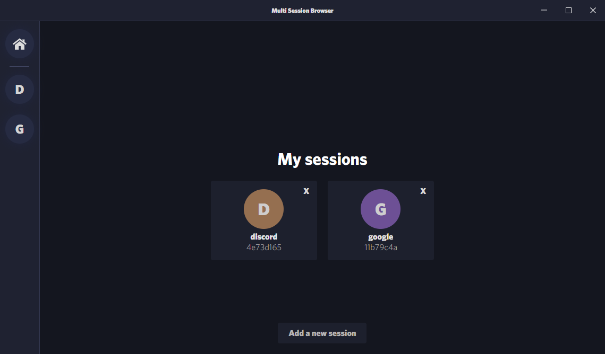

# multi-session-browser
A work-in-progress Chromium browser that supports multiple persistent sessions.

# Stack & main dependencies used
- [Electron](https://www.electronjs.org/): for the desktop app, obviously :).
- Electron [webviews](https://www.electronjs.org/docs/api/webview-tag): used alongside with partitions for persistence.
- [lowdb](https://github.com/typicode/lowdb): the local database where the sessions are stored at.

## Preview
